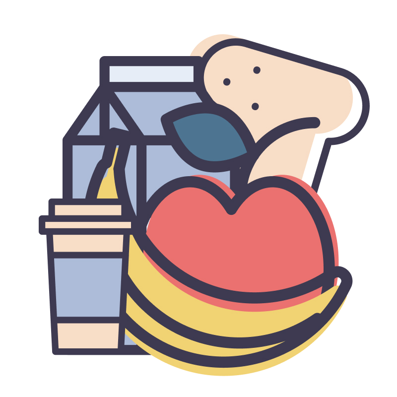
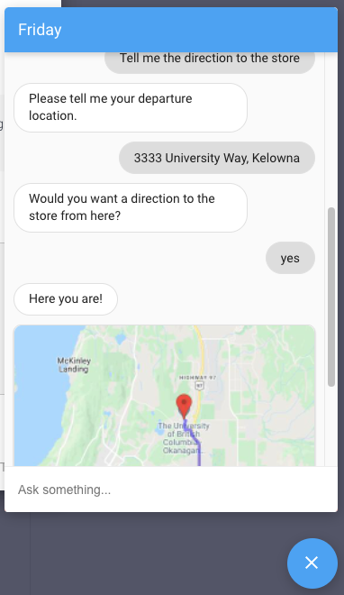
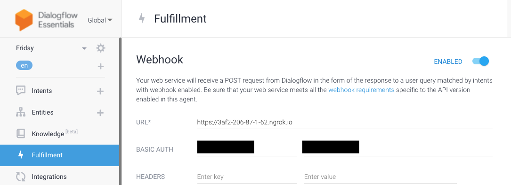
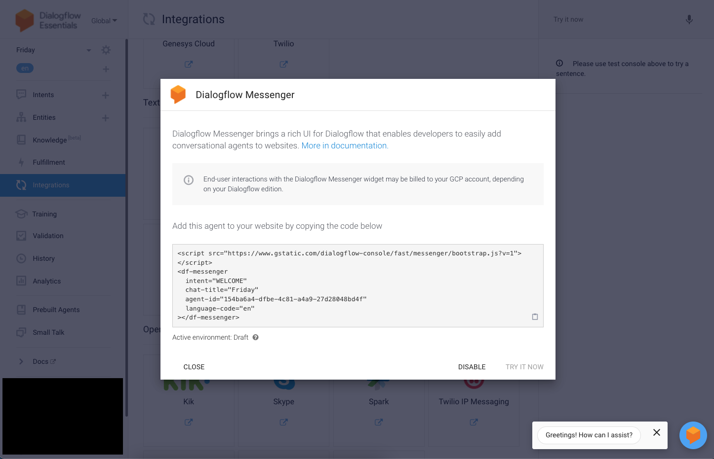

<!-- PROJECT LOGO -->
<div align="center">
  <a href="https://github.com/thuanGIT/grocery-chat-bot">
    
  </a>
  <h3 align="center">Grocery Chatbot</h3>
  <p align="center">
    Say hi to Friday! Our personal grocery assistant!
    <br />
    <!-- <a href="#"><strong>Explore the docs »</strong></a> -->
    <!-- <a href="#">View Demo</a> -->
    <!-- · -->
    <a href="https://github.com/thuanGIT/grocery-chat-bot/issues">Report Bug</a>
    ·
    <a href="https://github.com/thuanGIT/grocery-chat-bot/pulls">Request Feature</a>
  </p>
</div>

<!-- TABLE OF CONTENTS -->
## Table of Contents

* [About The Project](#about-the-project)
  * [Built With](#built-with)
* [Getting Started](#getting-started)
  * [Prerequisites](#prerequisites)
  * [Run Application](#run-application)
  * [Tunneling](#tunneling)
* [Usage](#usage)
* [Roadmap](#roadmap)
* [Contributing](#contributing)
* [Contributors](#contributors)
* [License](#license)
* [Contact](#contact)

<!-- ABOUT THE PROJECT -->
## About The Project

<div align="center">
  
</div>
</br>

Grocery shopping can be exhausting and frustrating. Have you ever with so long just to ask someone about a product price or maybe a direction to store? Sometimes, you wish there is something that can could give you answer right away?

And that something is what we built. Our project is a **simple grocery chatbot** to answer common queries that customers might have when shopping groceries. Below is the table of supported topcis:

Topics                    | Current status
--------------------------| --------------  
Product Information       | :white_check_mark:
Store Information         | :white_check_mark:
Contact Information       | :white_check_mark:
Feedback                  | :white_check_mark:

### Built With

* [Python](https://www.python.org/)
* [Flask](https://flask.palletsprojects.com/en/2.1.x/)
* [DialogFlow](https://cloud.google.com/dialogflow/)
* [DialogFlow Messenger](https://cloud.google.com/dialogflow/es/docs/integrations/dialogflow-messenger)
* [GoogleMaps Web Service](https://developers.google.com/maps/apis-by-platform)
* [Wolfram|Alpha API](https://products.wolframalpha.com/short-answers-api/documentation/)
* [PostgreSQL](https://www.postgresql.org/)

<!-- GETTING STARTED -->
## <a id="getting-started"></a> Getting Started

Please follow this guide to set up your local development environment. If you run into any problems, please [open issues](https://github.com/thuanGIT/grocery-chat-bot/issues) with tag `local_dev`.

### Prerequisites

To run the chatbot locally, you will need:

* **DialogFlow Console**: Please find my [contact](#contact) below to register as a contributor.
* **Docker**:
  * Please follow their Docker [documentation](https://docs.docker.com/get-docker/) to install Docker Desktop.
  * Once installed and launched, check docker and docker-compose version:

    ```bash
      docker --version
      docker-compose --version
    ```

* **Environment variables**: Some environment variables (DialogFlow auth & API keys) are required to start Docker containers.
  * Create a `.env` file under the project root. Docker-compose will find these variables here. Check out their [documentation](https://docs.docker.com/compose/environment-variables/).
  * Populate the file content with:

    ```bash
      WOLFRAM_API_KEY=key
      MAP_API_KEY=key
      AUTH_USER=user
      AUTH_PASSWORD=password
    ```

* **ngrok**: Since the application is not yet deployed, we will use `ngrok` tool to tunnel to the requests. Please follow their [documentation](https://ngrok.com/download).
  * Once you are done, check if ngrok is on `PATH`:

    ```bash
    ngrok --version
    ```

### Run Application

Once all prerequisites are met, you can launch the containers to the webhook service as followed:

```bash
docker-compose up -d
```

If you need to rebuild the image, add the flag `--build` when running `docker-compose`.

### Tunneling

To set up a tunnel for our webhook service, run:

```bash
ngrok http 8080
```

Then, set ngrok url in DialogFlow Console as shown below:



<!-- USAGE EXAMPLES -->
## Usage

To run a simple demo of the chatbot, please attach the following tags to your test website (i.e. at the bottom of you `body` tag in any `*.html` that you are viewing):

```html
<script src="https://www.gstatic.com/dialogflow-console/fast/messenger/bootstrap.js?v=1"></script>
<df-messenger
  intent="WELCOME"
  chat-title="Friday"
  agent-id="154ba6a4-dfbe-4c81-a4a9-27d28048bd4f"
  language-code="en"></df-messenger>
```

Or, you can alternatively use a quick demo on DialogFlow Console.



<!-- ROADMAP -->
## Roadmap

Here, we list out top-priority features/tasks for the next release.

* [ ] Deploy the webhook service.
* [ ] Support multiple messages.
* [ ] Text-based step-by-step directions.
* [ ] Feedback flow instead of survey link.

See the [open issues](https://github.com/thuanGIT/grocery-chat-bot/issues) for a full list of proposed features (and known issues).

<!-- CONTRIBUTING -->
## Contributing

Contributions are ways to learn, inspire, and create. Any contributions you make are **greatly appreciated**.

If you have a suggestion that would make this better, please fork the repo and create a pull request. You can also simply open an issue with the tag `enhancement`. Thanks again!

1. Fork the Project
2. Create your Feature Branch (`git checkout -b feature/AmazingFeature`)
3. Commit your Changes (`git commit -m 'Add some AmazingFeature'`)
4. Push to the Branch (`git push origin feature/AmazingFeature`)
5. Open a Pull Request

## Contributors

* [Thuan Vo](https://github.com/thuanGIT)
* [Ngan Phan](https://github.com/nganphan123)
* [Sanjana Kanchamreddy](https://github.com/SanjanaCode)
* [Quan Le](https://github.com/SanaBob)
* [Paul Gray](https://github.com/paulgray01)

<!-- ACKNOWLEDGMENTS -->
## Acknowledgments

I would like to acknowledge the hard work of the contributors to the project. I am grateful to your contributions to make this project possible.

<!-- LICENSE -->
## License

Distributed under the MIT License. Please refer to `LICENSE` file for more information.

<!-- CONTACT -->
## Contact

If you have any questions, please contact me at thuan.votann@gmail.com or [LinkedIn](https://www.linkedin.com/in/thuantanvo/).

[Back to top](#)