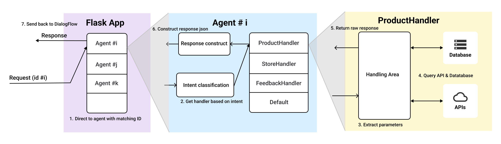

# Architectural Designs

This documentation will provide an overview of the overall system architecture as well as the processing architecture of the webhook service.

For more specific information on pipeline components and utilities, please visit [utilities](./utilities/README.md), [store & product](./store_product/README.md), and [others](./others/README.md).

## Directory structure

Here's the directory structure of the utilities package.

```bash
.
|- others               # Other Handlers (currently support feedbacks)
|- store_product        # Store & Product Handler
|- utilities            # Utilities components
|- agent.py             # Main agent
|- base_handler.py      # Define a common interface for all handlers
|- database.py          # Wrapper module to connect to PostgreSQL
|- error.py             # Custom errors
|- README.md           
```

## System Architecture


This repository hosts the **fullfillment service** (webhook) behind the Dialogflow integration (currently support **DialogFlow Messenger Beta**). Our webhook will listen for any **Webhook Request** from DialogFlow and return the approriate **Webhook Response**.

Please checkout their [documentation](https://cloud.google.com/dialogflow/es/docs/fulfillment-webhook) for request and response format.

## Processing Architecture



Our webhook service (**Flask App**) spawns a new unique agent for each conversation if authenticated via `Authentication` header and clean it up when the conversation ends.

**An agent** is the main entry point for processing intent. The agent does an initial processing on the request data to extract intent name and its paramter. Each agent has a mapping from intent to handler to call. Once an intent matches a handler, the agent call the corresponding handler to get the raw response.

**A handler** is responsible for querying the database and making API requests to return a raw response (string for text and bytes for imagte).

Then, the agent will construct the response json to return to DialogFlow based on which is given by the handler.

## Database

For our store database, we chose [**PostgreSQL**](https://www.postgresql.org/) as our DBMS. Below is the schema that we are using to store data. We hope to provide a better representation via UML diagram in the near feature.

**Note:** Some tables are not yet used in the current implementations. For development environment, we will use sample data to load into `postgres` container.

```sql
-- Store information
Store (StoreId, Address, PhoneNumber,Website,OpeningHours);
-- Product information
Product (ProductId, ProductName, ListPrice, Category, InStock);
-- Concern feedback
Concern (SessionId, PhoneNumber, Description, DateCreated, Status);
-- Employee information
Employee (EmployeeId, EmployeeName, Salary, SupervisorId);
-- Customer information
Customer (CustomerId, CustomerName);
-- Order information
Orders (OrderId, OrderDate, CustomerId, EmployeeId, Total);
-- Ordered Product information
OrderedProduct (OrderId, ProductId, Quantity, Price);
```

## External APIs

The webhook uses **GoogleMaps APIs** and **Wolfram|Alpha API** to construct its response in some intent cases. To understand more about its usage, please check out the [documentation](./utilities/README.md).

**Note:** API Keys are managed by the project owner and distributed to only contributors. Please contact me at **thuan.votann@gmail.com** to register as a contributor.

## References

- [DialogFlow Supported Architecture](https://cloud.google.com/dialogflow/es/docs/basics)
- [DialogFlow Fullfillment](https://cloud.google.com/dialogflow/es/docs/fulfillment-webhook)

## License

The source files are under MIT license. Please refer to the [LICENSE file](../../LICENSE) for more details.
